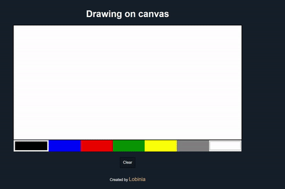

    

## Description

This is a basic drawing canvas feature, currently only works on mouse.

You can use it by simply clicking on the canvas and dragging the mouse around it, the default color is black, but it can be changed to 5 more predefined colors or if you're feeling creative you can use the color picker at the end and get whatever color you want.